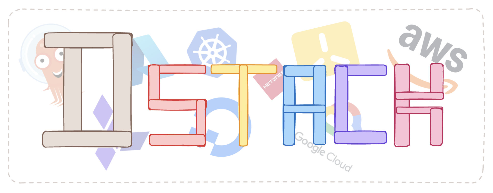

# DStack



DStack is a Kubernetes platform template split into two logical processes:

1. **Provisioning (IaC):** Terraform
2. **Configuration (GitOps):** Argo CD, Kubernetes

DStack is a practical starter template for building a stable, highly available,
and scalable container platform.

> DStack is a starter template, not a production platform distribution. Even
> though production-oriented configuration is included, hardening should be
> applied per environment.

> TIP: Send this repository to your AI agent & discuss!

## Contents

The repository is split into two main directories:

```text
infrastructure/terraform/
  modules/      # reusable Terraform modules
  providers/    # deployable cloud stacks

k8s-cluster-configuration/kustomize/
  platform/     # Argo CD and shared platform components
  applications/ # workload Application examples
```

Use `infrastructure` for provisioning. Use `k8s-cluster-configuration` for
Kubernetes configuration.

The current repository includes working patterns for AWS and Azure.

## Provisioning

`infrastructure/terraform` follows a standard module-based Terraform approach.

```text
infrastructure/terraform/
  modules/
    aws/eks/
    azure/aks/
  providers/
    aws/<region>/common/
    aws/<region>/eks/
    aws/<region>/eks-argocd/
    azure/<region>/common/
    azure/<region>/aks/
    azure/<region>/aks-argocd/
```

The `common` stacks create shared cloud resources such as remote state storage
and secret-management primitives. The `eks` and `aks` stacks create Kubernetes
clusters. The `*-argocd` stacks install Argo CD through Helm.

The Terraform modules support production-oriented settings, but the checked-in
provider stacks are deliberately minimal and cost-conscious examples.

## Configuration

`k8s-cluster-configuration` follows a GitOps approach built around Argo CD
self-management and app-of-apps.

```text
k8s-cluster-configuration/kustomize/platform/core/     # platform components
k8s-cluster-configuration/kustomize/platform/argocd/   # Argo CD self-management
k8s-cluster-configuration/kustomize/applications/      # workload Applications
```

There is an app-of-apps for platform components and another app-of-apps for
applications. Application examples show two organization patterns:

- company-owned applications
- customer-owned applications

The platform baseline is intentionally small. Optional components for
observability, backup, autoscaling, supply-chain security, storage, and cloud
integrations are included but commented out. Enable them per environment.

> With AI agents, self-managing this kind of platform is much easier. The repo
> is designed to be inspected, discussed, and adapted.

## How To Use

### Infrastructure

1. Apply the cloud `common` Terraform stack.
2. Apply the cluster Terraform stack: `eks`, `aks`, etc.
3. Apply the matching `*-argocd` Terraform stack.

### Configuration

1. Configure Argo CD self-management for your repository, domain, and routing.
2. Enable the platform components you need in `platform/core/kustomization.yml`.
3. Add workload Applications under `applications`.
4. Let Argo CD sync the platform and workloads.

## Checks

Run from the repository root:

```sh
terraform fmt -check -recursive infrastructure/terraform

kustomize build k8s-cluster-configuration/kustomize/applications
kustomize build k8s-cluster-configuration/kustomize/platform/core
kustomize build --enable-helm k8s-cluster-configuration/kustomize/platform/argocd/base/core
```

Run Terraform validation from a specific stack directory:

```sh
terraform init -backend=false
terraform validate
```

